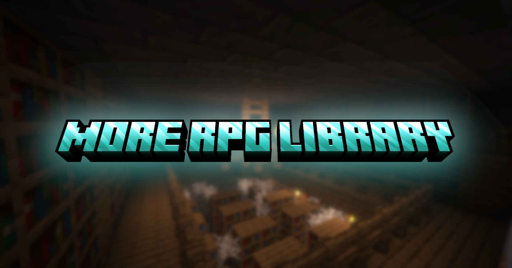

# More RPG Library

A general-purpose library for all my RPG content mods:
new entity attributes, status effects, weapon skills, mob AI goals, mob animations, an entity attribute config system and more.
Feel free to use it as a dependency for your own mod!

**Optional mods.** Nothing here is required except the library itself.
[Spell Engine](https://github.com/ZsoltMolnarrr/SpellEngine), Spell Power, [playerAnimator](https://modrinth.com/mod/playeranimator), [Better Combat](https://modrinth.com/mod/better-combat), [Combat Roll](https://modrinth.com/mod/combat-roll), Runes, Ranged Weapon API and Critical Strike are all optional.
Install one and the matching parts light up, everything else keeps working without it.
Each section below says when it needs one of them.

[](https://fabricmc.net/)
[](https://www.curseforge.com/minecraft/mc-mods/more-rpg-library)
[](https://modrinth.com/mod/more-rpg-library)
[](https://discord.com/invite/AShKd5XrTu)
[](https://ko-fi.com/fichteee)

---

## Contents

**For players and modpack makers**

1. [Assets](#1-assets)
2. [New Spell Schools](#2-new-spell-schools)
3. [New Entity Attributes](#3-new-entity-attributes)
4. [Status Effects](#4-status-effects)
5. [Weapon Skills](#5-weapon-skills)

**For datapack makers**

6. [Custom Spell Impacts](#6-custom-spell-impacts)
7. [Loot Table Enhancements](#7-loot-table-enhancements)

**For mod developers**

8. [Mob Spell Casting](#8-mob-spell-casting)
9. [Spellcaster Flee and Positioning Goals](#9-spellcaster-flee-and-positioning-goals)
10. [Mob Animations (playerAnimator bridge)](#10-mob-animations-playeranimator-bridge)
11. [Better Combat and Combat Roll for Mobs](#11-better-combat-and-combat-roll-for-mobs)
12. [Entity Attribute Config](#12-entity-attribute-config)

---

### 1. Assets
- New **Animations** (played through the playerAnimator mod)
- New **Sound Effects**
- Several new **Particle Effects**

### 2. New Spell Schools
Needs Spell Power installed. Spell schools are Spell Power's own system, this library just adds more of them.

**🧙‍♂️Magic Spell Schools**
- **🌪️Air Magic**
- **🪨Earth Magic**
- **🌊Water Magic**
- **🍃Nature Magic**

**🏹Ranged Spell Schools**
- **🔥Fire Ranged**
- **❄️Frost Ranged**

**🗡️Melee Spell Schools**
- **🪓Rage Melee**

### 3. New Entity Attributes
These work for every living entity, players and mobs alike.
All of them start at 100, which means "off". Everything above 100 is the strength in percent, so 150 = 50% and 200 = 100%.

| Attribute | ID | What it does |
|---|---|---|
| Damage Reflect | `mrpg_lib:damage_reflect_modifier` | Direct hits you take are reflected back at the attacker as thorns damage. 200 = 100% of the damage is reflected. |
| Lifesteal | `mrpg_lib:lifesteal_modifier` | Heals you for part of the health your hits actually removed. 200 = 100%. |
| Spell Vampire | `mrpg_lib:spell_vampire` | Heals you for part of the spell damage you deal. 200 = 100%. |
| Rage | `mrpg_lib:rage_modifier` | Extra damage for non-spell attacks, the lower your health the more. Bonus = attack damage × (Rage − 100)% × missing health %. |
| Fuse | `mrpg_lib:<school>_fuse_modifier` | Your non-spell hits also deal magic damage of that school: spell power × (Fuse − 100)%. At most once per second. Exists for `air`, `arcane`, `earth`, `fire`, `frost`, `healing` and `water`.<br>*Needs Spell Power.* |
| Burning Chance | `mrpg_lib:burning_chance` | Chance to apply [Ignited](#4-status-effects) for 2 seconds. |
| Stagger Chance | `mrpg_lib:stagger_chance` | Chance to apply [Stagger](#4-status-effects) for 4 seconds. |
| Stun Chance | `mrpg_lib:stun_chance` | Chance to apply Spell Engine's Stun for 2 seconds.<br>*Needs Spell Engine.* |
| Freeze Chance | `mrpg_lib:freeze_chance` | Chance to apply [Frozen Solid](#4-status-effects) for 3 seconds. |
| Poison Chance | `mrpg_lib:poison_chance` | Chance to apply vanilla Poison for 6 seconds. |
| Bleeding Chance | `mrpg_lib:bleeding_chance` | Chance to apply Spell Engine's Bleed for 6 seconds.<br>*Needs Spell Engine.* |
| Armor Piercing | `mrpg_lib:armor_piercing` | Your non-spell hits ignore part of the target's armor and armor toughness. 200 = armor is ignored completely. |
| Tenacity | `mrpg_lib:tenacity` | Chance to resist a harmful status effect when it gets applied. 150 = 50% chance, 200 = immune. Bad Omen, Trial Omen and Raid Omen are never resisted. |

About the chance attributes:
- They trigger on melee hits and projectile hits, never on spells.
- The level of Ignited, Stagger, Poison and Bleed scales with the attacker's damage (15% of attack damage, or of ranged damage for projectiles).
- Ignited, Stagger, Stun and Frozen Solid share an 8 second cooldown per attacker. Poison and Bleed share a 4 second cooldown.

Lifesteal and Spell Vampire have a 1 second cooldown each, `lifestealCooldownTicks` and `spellVampireCooldownTicks` in `config/mrpg_lib/tweaks_v2.json`.

### 4. Status Effects
Status effects that spells, weapons and mobs of my content mods (and yours) can apply.
Numbers are per level unless the text says otherwise.
The attribute modifiers of every effect can be changed in `config/mrpg_lib/effects_v4.json`.

Several effects change Spell Engine's `damage_taken` / `healing_taken` attributes or Spell Power's spell vulnerability.
Those parts only work when that mod is installed, the rest of the effect still works without it.
Frozen Solid, Soaked and Arcane Precision switch to a standalone version without Spell Power.

**Harmful effects**

| Icon | Effect | ID | Description |
|---|---|---|---|
|  | Molten Armor | `mrpg_lib:molten_armor` | Melts the target's armor: −10% armor and −1 armor toughness. Burns for 1.5 damage every 2 seconds while wearing a full armor set, 0.5 with only some pieces (every second from level II on). Ends in water or when the target wears no armor. |
|  | Frozen Solid | `mrpg_lib:frozen_solid` | Freezes the target in a block of ice and builds up freezing like powder snow. Fire or lava thaws it, freeze-immune mobs can't be frozen.<br>*With Spell Engine: the target can't move, jump, attack, use items or cast spells, mobs stop thinking, it takes 15% more damage and the first direct hit breaks the ice.*<br>*With Spell Power: frost spells get +10% critical chance and +20% critical damage against it.* |
|  | Frosted | `mrpg_lib:frosted` | −5% movement speed and builds up freezing like powder snow. When it is applied at level V it turns into Frozen Solid for 5 seconds (the level is `effect_frosted_amplifier_frozen_solid_conversion` in `tweaks_v2.json`, 4 = level V). Can't be applied to frozen or freeze-immune targets, fire and lava remove it. |
|  | Ignited | `mrpg_lib:ignited` | Burns the target for 1 fire damage every half second (+0.1 per level above I).<br>*With Spell Engine: −10% healing taken, and the target can't move, attack, use items or cast spells (it can still jump), mobs stop thinking.* |
|  | Stagger | `mrpg_lib:stagger` | −80% attack damage, armor and movement speed.<br>*With Spell Engine: the target can't attack, use items or cast spells, mobs stop thinking.* |
|  | Fear | `mrpg_lib:fear` | −25% attack damage.<br>*With Spell Engine: the target can't attack, use items or cast spells, mobs stop thinking.* |
|  | Grievous Wounds | `mrpg_lib:grievous_wounds` | +5% damage taken and −10% healing taken.<br>*Needs Spell Engine.* |
|  | Carve | `mrpg_lib:carve` | −10% armor and +5% damage taken.<br>*The damage taken part needs Spell Engine.* |
|  | Wither's Curse | `mrpg_lib:withers_curse` | +5% damage taken. Its level grows with the number of other status effects on the target, and every time it grows it lasts 2 seconds longer.<br>*Needs Spell Engine.* |
|  | Soaked | `mrpg_lib:soaked` | Soaks the target with water. If it is on fire, the fire goes out and Soaked ends. Lava also ends it.<br>*With Spell Power: frost spells deal +15% damage and +30% critical damage against it.* |
|  | Arcane Precision | `mrpg_lib:arcane_precision` | Makes the target more vulnerable to arcane spells: +2.5% damage, +5% critical chance and +10% critical damage.<br>*Needs Spell Power, without it the effect does nothing.* |
|  | Fatal Poison | `mrpg_lib:fatal_poison` | Poison that can kill: 1 damage every 1.25 seconds (+1 per level above I). Unlike vanilla Poison it also hurts undead. Mobs in `#mrpg_lib:poison_immune` (bogged and witches by default) are immune. |
|  | Marked by the Duelist | `mrpg_lib:duelists_focus_target` | Takes 25% more damage from the Duelist who marked it. Applied together with Duelist's Focus. |
|  | Bleeding | `mrpg_lib:bleeding` | **Deprecated**, use Spell Engine's `spell_engine:bleed` instead. Only kept so old worlds still load. Damage over time that gets stronger the lower the target's health is. |

**Beneficial effects**

| Icon | Effect | ID | Description |
|---|---|---|---|
|  | Collected Soul | `mrpg_lib:collected_soul` | +0.1 Soul spell power per stack.<br>*Needs Spell Power.* |
|  | Zephyr's Speed | `mrpg_lib:zephyrs_speed` | +5% movement speed and higher critical chance.<br>*The critical chance part needs Spell Power.* |
|  | Dragonslayer's Fury | `mrpg_lib:dragonslayers_fury` | Increases critical damage.<br>*Needs Spell Power or Critical Strike.* |
|  | Siren's Tear | `mrpg_lib:sirens_tear` | Heals every second, more the lower your health is: 5% of max health × your missing health share (2.5% at half health). Below 5% health it heals the full 5%. |
|  | Duelist's Focus | `mrpg_lib:duelists_focus_owner` | You take 25% less damage from everyone except your marked target, and the marked target takes 25% more damage from you. |

### 5. Weapon Skills
Melee weapon skills in the `mrpg_lib` namespace, ready to be assigned to any weapon through a Spell Engine spell container.
They live in this library so several content mods can share them without depending on each other.
Needs Spell Engine.

All three use the shared `weapon` cooldown group.

| Icon | Skill | ID | Description |
|---|---|---|---|
|  | Burstcrack | `mrpg_lib:burstcrack` | Charged (up to 1.5 s) — release a shockwave around you that hits every enemy nearby for 50% of your attack damage and knocks them up (bosses are not knocked up). The longer you charge, the further it reaches (5.5 blocks, up to +3 at full charge) and the harder it hits. You move at 25% speed while charging. Cooldown: 15 s.<br>*Typically assigned to: knuckles (Forcemaster).* |
|  | Decapitate | `mrpg_lib:decapitate` | Cast (0.75 s) — a heavy 180° swing with forward momentum, dealing 25% bonus damage. Disables the target's shield and stops its item use for 2 seconds. Cooldown: 15 s.<br>*Typically assigned to: berserker axes (Berserker).* |
|  | Puncture | `mrpg_lib:puncture` | Cast (0.7 s) — dash forward in a series of 6 quick thrusts with 20% bonus damage each, striking every enemy along your path once. Can't be used in the air. Cooldown: 10 s.<br>*Typically assigned to: rapiers (Bards).* |

---

## For datapack makers

### 6. Custom Spell Impacts
Needs Spell Engine installed. These handlers are referenced from a spell's `impacts` list in its spell JSON:
```json
  "impacts": [
    {
      "action": {
        "type": "CUSTOM",
        "custom": {
          "intent": "HARMFUL",
          "handler": "mrpg_lib:knock_up_fixed"
        }
      }
    }
  ]
```

| Handler | What it does |
|---|---|
| `mrpg_lib:knock_up` | Knocks the target up (scalable). |
| `mrpg_lib:knock_up_fixed` | Knocks the target up by a fixed amount (0.75 Y velocity by default). |
| `mrpg_lib:stop_arrows` | Stops arrows, their velocity is set to 0. |
| `mrpg_lib:lightning` | Summons a lightning strike on the target. |
| `mrpg_lib:trembling` | Throws the target around in random directions. |
| `mrpg_lib:range_scaled_knockback` | Knockback that gets stronger the closer the target is to the caster. |
| `mrpg_lib:frozen_ticks` | Adds freezing ticks to the target. |
| `mrpg_lib:damage_according_to_missing_health` | Damage based on the target's missing health, scaled with the caster's spell school power: 0.25× above 50% health, 1.0× below 50%, 1.75× below 25%. |
| `mrpg_lib:spellthief_impact` | Steals all beneficial status effects of the target, then casts one of the target's spells: a random active spell of a player, or a random spell from a spell-casting mob's `<namespace>:mob/<entity>/...` spell tags. |
| `mrpg_lib:pull_to_caster_direct` | **Deprecated.** Pulls the target directly in front of the caster. |
| `mrpg_lib:pull_to_caster_slow` | **Deprecated.** Pulls the target slowly to the caster (for channeled spells). |
| `mrpg_lib:rush_forward_to_target` | **Deprecated.** The caster rushes forward to the target. |
| `mrpg_lib:backward_dash_fixed` | **Deprecated.** The caster dashes back a fixed distance. |
| `mrpg_lib:backward_dash_range` | **Deprecated.** The caster dashes back, scaled with the spell's `range`. |
| `mrpg_lib:forward_dash_range` | **Deprecated.** The caster dashes forward, scaled with the spell's `range`. |

The deprecated handlers still work, but for new spells Spell Engine's own `VELOCITY` impact is the better choice.
Strengths like the knock up height, pull speed, dash range and the missing health multipliers can be tuned in `config/mrpg_lib/tweaks_v2.json`.

### 7. Loot Table Enhancements
The spell scroll and spell pool functions need Spell Engine installed. The conditional item function and entry don't.

**Spell scroll from specific spell pools 📜**

Adds a spell scroll with a spell from the given pools. You can limit the spell tier and blacklist spells.
```json
{
  "type": "minecraft:item",
  "name": "spell_engine:scroll",
  "functions": [
    {
      "function": "mrpg_lib:specific_spell_scroll_pool",
      "spell_pools": ["#wizards:frost", "#wizards:fire"],
      "spell_tier_min": 3,
      "spell_tier_max": 4,
      "count": 1,
      "blacklist_spells": ["wizards:frost_blizzard", "wizards:fire_meteor"]
    }
  ]
}
```

**Bind spells from spell pools on an item**

Binds a random spell from the pools to the item. If the item is not a spell container yet, it becomes one.
```json
{
  "type": "minecraft:item",
  "name": "minecraft:diamond_sword",
  "functions": [
    {
      "function": "mrpg_lib:bind_spell_from_pools",
      "spell_pools": ["#wizards:arcane", "#wizards:frost"],
      "count": 1
    }
  ]
}
```

**Conditional item with fallback**

Drops the conditional item if it is registered, otherwise the entry's own item is used as the fallback.
```json
{
  "type": "minecraft:item",
  "name": "minecraft:diamond",
  "functions": [
    {
      "function": "mrpg_lib:conditional_item",
      "conditional_item": "your_mod:jade_gem"
    },
    {
      "function": "minecraft:set_count",
      "count": {
        "min": 1,
        "max": 4
      }
    }
  ]
}
```

**Conditional item entry**

A loot pool entry without a fallback. If the item is not registered, the entry is skipped and the loot table keeps working.
```json
{
  "type": "mrpg_lib:conditional_item",
  "item": "your_mod:jade_gem",
  "count": {
    "type": "minecraft:uniform",
    "min": 1,
    "max": 3
  }
}
```

---

## For mod developers

### 8. Mob Spell Casting
Needs Spell Engine installed.

`com.mrpg_lib.compat.spell_engine.MobSpellCastGoal` lets any mob cast Spell Engine spells.
Delivery type, particles, sounds, channeling and cooldown all come from the spell JSON, so there is nothing to configure by hand.

**Setup**

1. Implement `ISpellCasterEntity`
```java
public class MyWizard extends HostileEntity implements ISpellCasterEntity {

    private boolean isCasting = false;
    private int castingTicks = 0;

    @Override public void startSpellCast(int ticks) { isCasting = true;  castingTicks = ticks; }
    @Override public void stopSpellCast()           { isCasting = false; castingTicks = 0;     }
    @Override public boolean isSpellcasting()       { return isCasting; }
    @Override public MobEntity asMobEntity()        { return this; }
}
```
2. Add the goals in `initGoals()`.
The spell argument is a plain spell ID string or a `#`-prefixed tag. Passing the shared `spellGoals` list prevents two goals from firing at the same time.
```java
private final List<MobSpellCastGoal> spellGoals = new ArrayList<>();

@Override
protected void initGoals() {
    MobSpellCastGoal fireball  = new MobSpellCastGoal(this, "mymod:fireball",  spellGoals);
    MobSpellCastGoal frostbolt = new MobSpellCastGoal(this, "mymod:frostbolt", spellGoals);

    this.goalSelector.add(1, fireball);
    this.goalSelector.add(2, frostbolt);

    spellGoals.add(fireball);
    spellGoals.add(frostbolt);
}
```
To pick randomly from a group of spells, pass a tag instead of a single ID:
```java
new MobSpellCastGoal(this, "#mymod:mob/wizard_spells", spellGoals)
```
The mob picks one available (off-cooldown) spell from the tag each cast.
The goal tracks cooldowns against world time itself, you don't need to call anything. `updateCooldown()` still exists but does nothing.

---

**Custom timings (optional)**

By default the goal uses the spell's own cast/channel duration and cooldown. To give a mob its own values, use `withTimings`:

```java
MobSpellCastGoal fireball = new MobSpellCastGoal(this, "mymod:fireball", spellGoals)
        .withTimings(SpellTimings.builder().castSeconds(1.2F).cooldownSeconds(6F).build());

MobSpellCastGoal beam = new MobSpellCastGoal(this, "#mymod:mob/wizard_spells", spellGoals)
        .withTimings(SpellTimings.cooldown(4F))
        .withTimings("mymod:death_ray", SpellTimings.channel(3F));
```

- `withTimings(timings)` applies to every spell of the goal, `withTimings(spellId, timings)` to one spell only. Per-spell wins over goal-wide, which wins over the spell's own value.
- `castSeconds` replaces the cast duration. For channel spells it is the total channel length, and `channelSeconds` (channel spells only) wins if both are set.
- `cooldownSeconds` replaces the cooldown. `0` means no cooldown.
- `channelTicks` (optional) changes how many times a channel spell releases. Default is the spell's own count, so damage per cast stays the same when you only change the duration.
- Anything you leave unset falls back to the spell. Cast time is never below 1 tick.

The overridden cast time is what `startSpellCast(int ticks)` receives.
If you play your own fixed-length animation, it will not stretch to fit by itself, so loop it or scale it from that tick count.
The spell's own animations (`withAnimations(true)`, see [section 10](#10-mob-animations-playeranimator-bridge)) do follow the overridden cast time.

---

**What works automatically**

| Feature | Driven by |
|---|---|
| Projectile, Meteor, Cloud, Direct, Area, Beam, Teleport | `spell.json` delivery + target type |
| Custom deliveries (`deliver.type: CUSTOM`) | the handler registered with Spell Engine's `SpellHandlers.registerCustomDelivery`, see **Custom deliveries** below |
| Delivery delay | `spell.deliver.delay` |
| Arrow spells (`SHOOT_ARROW`, `AFFECT_ARROW`) and stash spells (`STASH_EFFECT`) | see **Arrow, stash and summon spells** below |
| Melee weapon skills (`MELEE`) and melee-range spells (`range_mechanic: MELEE`) | see **Melee spells** below |
| Area impacts (`area_impact`) of direct spells | `spell.area_impact` |
| Cast duration, channeling & charging (timed like for players: a spell with a cast time goes off at the end of the cast, a channel spell releases every interval starting half an interval in, and each release deals its share of the spell, not the full amount) | `spell.active.cast.duration` / `type` (`CHANNEL` / `CHARGE`) |
| Cast start sound & particles | `spell.active.cast.start_sound` / `particles` |
| Release particles & sound (for channel spells once at the end, or on every release with `channel.release_fx`) | `spell.release.particles` / `sound` |
| Impact handling | SpellEngine internals |
| Cooldown | `spell.cost.cooldown.duration` (or `withTimings`) |
| `particles_scaled_with_ranged` | scaled by `spell.range` automatically |

---

**Healing spells**

Spells whose **entire** impact list is `HEAL` are cast on the nearest wounded ally instead of the combat target.

Spells that mix `HEAL` with damage or other impacts target the combat target normally. Spell Engine's relation system prevents the heal from applying to enemies.

---

**Charge spells**

For a spell authored with `spell.active.cast.type = CHARGE`, the mob charges like a player holding the key: the charge fills over the cast duration and the mob lets go when it has charged enough.
- If the charge adds range (`charge.bonus.range_add`, e.g. Venom Cask), the mob charges just enough for the spell to reach its target, and starts the cast when the target is within the fully charged range.
- Otherwise it charges fully, unless the target is within 3 blocks, then it releases at `min_release_ratio`.
- It never releases below `min_release_ratio`.

---

**Arrow, stash and summon spells**

- `SHOOT_ARROW` spells (e.g. Barrage) fire real arrows, including the extra arrows of the spell, with the spell's arrow perks and on-hit impacts. The mob needs a combat target and something in its main hand (any item, a bow is the natural choice), otherwise the spell is not picked. Mobs don't need arrows in their inventory.
- `AFFECT_ARROW` spells change the mob's next arrow fired within 5 seconds.
- `STASH_EFFECT` spells (e.g. Power Shot) put the stash effect on the mob just like on a player, and the stashed spell is only used when its trigger fires. Mobs support `ARROW_SHOT` stashes: skeletons, strays, bogged, and any mob shooting through a bow or crossbow (pillagers, piglins, arrow spells) use up the stash and carry its spell on the arrow. A self-targeted stash spell is only cast while the mob has a combat target. Other trigger types (melee hit, damage taken, ...) are still player-only in Spell Engine.
- Summons (e.g. Spirit Wolf) treat the casting mob as their owner: they follow it, defend it, attack what it attacks and are scaled from its attributes. Summons of a mob using `ISpellCasterEntity` don't attack other mobs unless provoked, the same way the caster itself treats them.

---

**Melee spells**

- Spell Engine runs `MELEE` weapon skills (e.g. Swift Strikes, Swipe) on the player's client, so for mobs the goal runs them on the server instead. It uses the same data: every attack in `deliver.melee.attacks` with its delay, extra strikes, hitbox (length, width, height, roll, arc), `forward_momentum`, `movement_slipperiness`, `damage_bonus`, animation, swing and impact sounds. Each hit is a normal mob attack (`tryAttack`, so the mob needs an attack damage attribute), followed by the spell's own impacts.
- Reach is Spell Engine's melee range for non-players (3 blocks plus `spell.range`). The mob walks to its target before swinging, and only swings once the target is in reach (plus the dash distance for skills with `forward_momentum`). If it can't get there within 2 seconds it gives up without going on cooldown.
- Attack length follows the mob's attack speed attribute, or a sword-like 1.6 attacks per second if the mob has none.
- Spells with `range_mechanic: MELEE` (e.g. Ground Slam) are only started when the target is within that reach, and the mob moves towards the target instead of backing away while casting. If the target escapes before the release, an area impact still lands in front of the mob, like a player's missed slam.
- Area impacts of direct spells hit everything around the target that the caster may hurt (for a hostile caster: players, villagers and other non-hostile mobs, never other hostile mobs), with the area's particles and sound.
- Area spells with melee range (e.g. Whirlwind) use the same 3 block reach. While channeling, the mob keeps walking into its target and every release hits everything around it that it may hurt.

---

**Custom deliveries**

Spells with `deliver.type: CUSTOM` run the same handler as for players. The content mod registers it once at startup, for example `SpellHandlers.registerCustomDelivery(Identifier.of("mymod", "my_delivery"), (world, spellEntry, caster, targets, context, targetLocation) -> { ... })`, and sets `spell.deliver.custom.handler = "mymod:my_delivery"`. Nothing extra is needed for mobs, but the handler gets the mob as `caster`, so it must not assume a player.
- Targets are found like for players, from where the mob looks (it faces its target before the release). For `AIM` spells the combat target is used if the look ray misses.
- Spells with target type `NONE` are cast too when they use a custom delivery, while the mob has a target in range.
- Spells with target type `FROM_TRIGGER` are never picked, they only run from a trigger.

---

**Intelligent Spellcasting**

Enable situational spell selection per goal by calling `.withIntelligentSpellcasting()`:
```java
MobSpellCastGoal fireball = new MobSpellCastGoal(this, "mymod:fireball", spellGoals)
        .withIntelligentSpellcasting();
```

When enabled, before casting the goal runs these filters in order:
- **Self-heal priority**: if the caster is below 50% HP and has a pure heal spell available, only heal spells are considered.
- **Ally-heal priority**: if an ally is below 60% HP and a heal spell is available, only heal spells are considered.
- **Kill priority**: if the target is below 30% HP, pure heal spells are skipped so the mob focuses on finishing the target.
- **`SpellBehaviorRegistry`**: any custom per-spell condition registered externally (see below).

---

**SpellBehaviorRegistry**

Register custom cast conditions for specific spells. Conditions registered here are checked when intelligent spellcasting is active:
```java
SpellBehaviorRegistry.register(
    Identifier.of("mymod", "updraft"),
    (caster, target, spellId) -> target != null && !target.isOnGround()
);
```

The condition receives the caster, the current target (nullable) and the spell ID. Return `false` to skip this spell this tick, the goal moves on to the next available spell.

For a distance gate there is a ready-made condition. For example, only throw Venom Cask when the target is 6 to 14 blocks away:
```java
SpellBehaviorRegistry.register(
    Identifier.of("archers_expansion", "venom_cask"),
    SpellBehaviorRegistry.targetDistance(6.0, 14.0)
);
```

---

**Equipment and passive-tag spells**

Off by default, so existing mobs keep casting exactly as before. Turn either on per goal:
```java
MobSpellCastGoal fireball = new MobSpellCastGoal(this, "mymod:fireball", spellGoals)
        .withEquipmentSpells(true)
        .withPassiveSpellTag("#mymod:mob/wizard_passives");
```
- `withEquipmentSpells(true)` reads the caster's mainhand item for passive and modifier spells, the same way a player wielding it would benefit from them.
- `withPassiveSpellTag(tag)` grants passive spells straight from a spell tag, independent of any weapon. Same idea as the spell tag you already pass in as the mob's castable spells, just for passives.
- Call `resolvedPassiveSpells(world)` to read everything currently granted from either source.

A modifier spell that matches the spell being cast extends its range (`range_add`).
The rest of what a modifier can do on a player (changing the impact, boosting power, projectile perks) is not applied to mobs yet, because Spell Engine's own modifier resolution only works for `PlayerEntity` casters.
Passive spells are resolved and exposed the same way, but their triggers (on-hit, periodic) are not auto-dispatched for the same reason.

### 9. Spellcaster Flee and Positioning Goals
Needs Spell Engine installed. These goals work with `ISpellCasterEntity` from [section 8](#8-mob-spell-casting).

Ready-made AI goals for spell-casting mobs that need to keep their distance and flee when low on health.

**`IConditionalFleeEntity`**

Implement this interface on your entity to unlock the two goals below. Your entity must extend `PathAwareEntity` (or any subclass) to use `LowHealthFleeGoal`. All methods have defaults, so override only what you need:

```java
public class MyWizard extends PathAwareEntity implements ISpellCasterEntity, IConditionalFleeEntity {

    @Override public float getFleeDistance()         { return 4.0F; }
    @Override public float getLowHealthFleeDistance() { return 6.0F; }

    @Override public List<Identifier> getFleeImmuneEffects() {
        return List.of(Identifier.of("mymod", "arcane_shield"));
    }

    @Override public List<Identifier> getFleeIgnoreIfTargetHasEffects() {
        return List.of(Identifier.of("mymod", "frost_snare"));
    }

    @Override public float getFleeIgnoreTargetHpThreshold() { return 0.3f; }
}
```
- `getFleeImmuneEffects`: effects on the caster that stop it from fleeing (e.g. a damage immunity shield).
- `getFleeIgnoreIfTargetHasEffects`: effects on the target that stop the caster from fleeing (e.g. a snare or root).
- `getFleeIgnoreTargetHpThreshold`: if the target's health share is below this value, the caster keeps attacking instead of fleeing. `0` turns it off.

**`LowHealthFleeGoal<T extends PathAwareEntity & IConditionalFleeEntity>`**

Flees from players when the mob drops below **35% HP**. Fleeing is skipped when any of the three conditions above is met (caster is immune, target is snared, or target is nearly dead).

```java
this.goalSelector.add(1, new LowHealthFleeGoal<>(this));
```

**`BackAwayGoal<T extends MobEntity & ISpellCasterEntity>`**

Backs away from the combat target whenever it gets closer than `minDistance` blocks. Stops as soon as it is safe, so spells can fire right away. Does nothing while the mob is already casting.

```java
this.goalSelector.add(2, new BackAwayGoal<>(this, 4.0F, 1.2));
```
The arguments are the mob, `minDistance` and the movement speed.

**Full example**

```java
@Override
protected void initGoals() {
    this.goalSelector.add(0, new SwimGoal(this));
    this.goalSelector.add(1, new LowHealthFleeGoal<>(this));
    this.goalSelector.add(2, new BackAwayGoal<>(this, 4.0F, 1.2));

    MobSpellCastGoal fireball  = new MobSpellCastGoal(this, "mymod:fireball",  spellGoals);
    MobSpellCastGoal frostbolt = new MobSpellCastGoal(this, "mymod:frostbolt", spellGoals);
    this.goalSelector.add(3, fireball);
    this.goalSelector.add(4, frostbolt);
    spellGoals.add(fireball);
    spellGoals.add(frostbolt);
}
```

### 10. Mob Animations (playerAnimator bridge)
Needs [playerAnimator](https://modrinth.com/mod/playeranimator). Without it, every call below quietly does nothing and none of its classes are loaded.

Lets mobs play playerAnimator animations, the same `player_animations/*.json` files Spell Engine and Better Combat use for players.

**How it works.**
The server sends a small packet (`mrpg_lib:mob_animation`) to the players tracking the mob.
The client keeps a playerAnimator animation stack on the entity and applies it to the mob's model right after vanilla poses it, so armor and held items follow.
Players are never touched, playerAnimator and Spell Engine keep handling those.
Players who start tracking a mob mid-animation get `persistent` animations replayed from the start.

**Server-safe API** (`com.mrpg_lib.compat.player_animator.api`, safe to call from goals even if playerAnimator is missing):
```java
MobAnimations.play(mob, Identifier.of("spell_engine", "one_handed_projectile_charge"));

MobAnimations.play(mob, animationId, MobAnimationOptions.DEFAULT
        .withLayer(MobAnimationLayer.CASTING)
        .withSpeed(1.5F)
        .withFadeTicks(4)
        .withMirror(MobAnimationOptions.Mirror.AUTO)
        .withPersistent(true)
        .withDuration(12));

MobAnimations.stop(mob, MobAnimationLayer.CASTING, 5);
MobAnimations.stopAll(mob, 5);
MobAnimations.playSpellAnimation(mob, MobAnimationLayer.RELEASE, "spell_engine:one_handed_projectile_release", 1F);
```
- `withLayer`: `OFF_HAND_POSE` < `POSE` < `MISC` < `ATTACK` < `CASTING` < `RELEASE` < `DODGE`, higher layers win. Default is `MISC`.
- `withFadeTicks`: `-1` uses the animation's own begin tick.
- `withMirror(AUTO)` mirrors the animation for left-handed mobs.
- `withPersistent(true)` replays the animation for players who start tracking the mob later, until it is stopped.
- `withDuration(ticks)` (optional) stretches the animation to last that long, float lengths work too.
- `withAttackTiming(length, upswingRate, upswingMultiplier)` plays an animation with Better Combat's attack speed curve instead of a constant speed: fast during the upswing, slower afterwards, so the hit frame lines up with the moment the damage lands (`length` in ticks, `upswingRate` and `upswingMultiplier` as Better Combat computes them). The Better Combat melee goal ([section 11](#11-better-combat-and-combat-roll-for-mobs)) uses it.

`animationId` is `<namespace>:<"name" field of the json>`, not the file name. Use `MobAnimations.isAvailable()` if you need to know whether playerAnimator is there.

**Spell casting mobs.** `MobSpellCastGoal` can play the spell's own animations: `.withAnimations(true)` plays `spell.active.cast.animation` while casting and `spell.release.animation` on release.
It is off by default so existing mobs look exactly as before. The cast animation speed follows an overridden cast time (`withTimings`).
Spells with `animation_spin` (e.g. Whirlwind) also spin the whole mob while casting, like players (this part works without playerAnimator).

**Custom models.** Models extending `BipedEntityModel` (zombie, skeleton, piglin, player-style models), `IllagerEntityModel` (vindicator, evoker, illusioner) and `VillagerResemblingModel` (villager, wandering trader, witch) work out of the box. For any other model, register an adapter on the client that maps your model parts to the animation bones:
```java
MobModelAdapters.register(new MobModelAdapter() {
    @Override
    public MobModelParts parts(EntityModel<?> model) {
        if (!(model instanceof MyMobModel m)) return null;
        return new MobModelParts(m.head, m.body, m.leftArm, m.rightArm, m.leftLeg, m.rightLeg);
    }
});
```
`prepare(model)` runs after vanilla posing and before the animation (fix visibility flags there), `finish(model)` runs after (copy transforms to overlay parts there). The adapter never sees playerAnimator types, so it keeps working if the bridge is later moved to another animation library.

**Limits.** Illager arms are shown uncrossed while an animation is active. Villagers and witches only have one crossed-arms part, so it follows the right arm of the animation (rotation and offset on top of its normal pose) and the left arm is ignored. The pitch adjustment Spell Engine applies to player casts is not used. Bend (elbow/knee) only works on biped models.

**Test command** (development environment only, op level 2): `/mrpg_anim <targets> <animation id> [speed]` and `/mrpg_anim <targets> stop`, for example `/mrpg_anim @e[type=zombie] spell_engine:one_handed_projectile_charge`.

### 11. Better Combat and Combat Roll for Mobs
Needs [Better Combat](https://modrinth.com/mod/better-combat) and [Combat Roll](https://modrinth.com/mod/combat-roll) respectively, both optional.
The factories below are safe to call from `initGoals()` whether the mod is installed or not, and nothing changes for mobs you don't give these goals to.
Nothing in the library adds these goals to mobs by itself.

**Better Combat melee** (`com.mrpg_lib.compat.better_combat.BetterCombatCompat`):
```java
goalSelector.add(2, BetterCombatCompat.createMeleeGoal(this, 1.0, false));
goalSelector.add(2, BetterCombatCompat.createMeleeGoal(this, 1.0, false,
        BetterCombatCompat.MeleeSettings.DEFAULT.withIntervalScale(1.5F)));
```
With Better Combat installed and a weapon that has Better Combat attributes in the main hand, the mob uses that weapon's combo the way a player would:
- Attacks cycle through the combo, and the combo resets when the mob stops swinging for a while.
- The attack animation and weapon pose play on the mob with the same speed curve Better Combat uses for players, and the hit lands after the weapon's upswing.
- Everything inside the weapon's hitbox is hit (not just the target), and each attack's damage multiplier is applied. Allies are never hit.
- The mob starts a swing once its target is within 80% of that attack's range, and moves slower while swinging (Better Combat's `movement_speed_while_attacking` times the attack's movement multiplier).
- It shows the weapon trail particles players get, and fast weapons deal reduced knockback like in Better Combat.
- If the mob's main-hand item changes mid-swing, the swing is cancelled.
- Range and attack speed come from the weapon.

Without the mod, or with a weapon that has no Better Combat attributes, it is a normal `MeleeAttackGoal`.

`MeleeSettings.DEFAULT` options:
- `baseRange` 3: reach before the weapon's range bonus, like a player
- `intervalScale` 1: above 1 makes the mob attack slower than a player with the same weapon
- `animations` on
- `resetInvulnerability` on: with Better Combat's `allow_fast_attacks`, a victim's hurt-cooldown is cleared before the hit, but only if this mob was the last one to hurt it, so a pack of mobs can't stack damage
- `weaponTrails` on

**Dual wielding**: with Better Combat weapons in both hands (neither two-handed) the mob alternates hands like a player: main, off, main, off, each hand going through its own combo, so dual-wield-only attacks such as the dagger's double stab show up too.
Off-hand swings use the off-hand weapon's attacks, range, damage, enchantments and trail, play the attack animation mirrored, and the off-hand weapon's pose (if it has one) is shown on the other arm.
Better Combat's `dual_wielding_attack_speed_multiplier` and the main/off-hand damage multipliers apply. While dual wielding, a change to either hand cancels the swing.

**Weapon poses**: if the weapon's Better Combat attributes have a `pose`, the mob holds the weapon in that stance the whole time it has the goal, not only in combat, and the pose changes or goes away as soon as the weapon does.
In Better Combat itself the claymore, hammer, heavy axe, katana, twin blade, scythe, spear, glaive, halberd, soul knife, heavy bow and heavy crossbow presets have one (so e.g. Paladins claymores and great hammers, Archers spears and Rogues glaives). Vanilla items have none.
It follows Better Combat's player rules:
- Two-handed weapons keep the full pose while walking. One-handed ones let the arms swing while the mob walks or sneaks and only keep the weapon itself posed.
- There is no pose while swimming, climbing, gliding, using an item, doing a vanilla arm swing, casting a spell or holding a loaded crossbow. The legs are left alone while riding.
- Left-handed mobs get it mirrored, and when dual wielding the off-hand weapon's pose goes on the other arm.

The weapon is checked whenever the mob's AI looks at the goal, so a mob with `NoAI` never gets a pose. If you remove the goal from a mob yourself, call `BetterCombatCompat.onGoalRemoved(goal)` to drop the pose.

**Attack speed**: the swing length is the same as a player's: `20 / attack speed` ticks, at least Better Combat's `attack_interval_cap`, times `intervalScale`.
If the mob has an attack speed attribute its value is used. Otherwise it is worked out like a player's would be: base 4.0 plus the attack speed modifiers of everything the mob wears and holds and of its status effects, with all modifier operations.
When dual wielding, `dual_wielding_attack_speed_multiplier - 1` (default 1.2, so +20%) is added as an `add_multiplied_base` modifier, which is how Better Combat does it for players. Both hands use this main-hand speed, as for players.

Better Combat's sweeping damage penalty is not applied to mobs.

**Combat Roll dodging** (`com.mrpg_lib.compat.combat_roll.CombatRollCompat`):
```java
CombatRollCompat.createRollGoal(this, CombatRollCompat.RollSettings.DEFAULT
        .withDefensiveHealthThreshold(0.4F)
        .withEngage(true, 5.0, 0.15F)
        .withDodgeProjectiles(true))
        .ifPresent(goal -> goalSelector.add(1, goal));
```
Returns an empty `Optional` without Combat Roll, so the mob simply never rolls.
With it, the mob rolls exactly like a player: roll count, recharge and distance come from the `combat_roll:count/recharge/distance` attributes if the mob has them (otherwise their default values), cooldown, roll duration, extra distance and invulnerability frames come from Combat Roll's server config, and it plays the `combat_roll:roll` animation and sound.
- It rolls away from its target when its health drops below the threshold.
- It can roll towards a target that is a few blocks away (`withEngage`).
- It can sidestep projectiles flying at it (`withDodgeProjectiles`).
- It never rolls into lava, fire, cactus, magma, berry bushes, powder snow or deep water, or off a drop of more than 3 blocks. If no direction is safe it doesn't roll.

Give it a better (lower) priority than the mob's melee or movement goals so it can interrupt them.

`RollSettings.DEFAULT`:
- `defensiveHealthThreshold` 0.35: roll away below 35% health
- `engage` off, `engageMinDistance` 5 blocks, `engageChance` 0.1 (`withEngage`)
- `dodgeProjectiles` off
- `cooldownTicks` 40: minimum time between rolls on top of the charges
- `invulnerableTicks` -1: use Combat Roll's i-frames from its config, any other value overrides them for this mob
- `animations` on (`withAnimations`)

**Trying it in a dev environment**

The `/mrpg_goal` command (op level 2) only exists in a development environment, normal players never get it.
- `/mrpg_goal <targets> bettercombat`, `/mrpg_goal <targets> combatroll` and `/mrpg_goal <targets> spellcast <spell_id>` add the matching goal to any mob you target (for example a zombie). `spellcast` needs Spell Engine installed.
- `/mrpg_goal <targets> combatroll dodge` gives the roll goal with only the projectile dodge turned on (no engage or low-health retreat rolls).
- `/mrpg_goal <targets> shoot [count]` fires that many test arrows at the targets from a ring around them, handy for testing the dodge.
- `/mrpg_goal <targets> clear` removes the goals again.

Give the mob a Better Combat weapon in its main hand to see the combos, or one in each hand to see dual wielding (for example `HandItems:[{id:"rogues:iron_dagger",count:1},{id:"rogues:iron_dagger",count:1}]`).

Weapon poses (needs playerAnimator):
```
/summon minecraft:husk ~3 ~ ~ {Tags:["goaltest"],PersistenceRequired:1b,HandItems:[{id:"paladins:iron_claymore",count:1},{}]}
/mrpg_goal @e[tag=goaltest] bettercombat
/item replace entity @e[tag=goaltest] weapon.mainhand with archers:iron_spear
/item replace entity @e[tag=goaltest] weapon.mainhand with minecraft:iron_sword
```
The husk should hold the claymore in Better Combat's two-handed sword pose right away, switch to the polearm pose with the spear and drop the pose with the iron sword.
Add `LeftHanded:1b` to see the mirrored pose.
Without Paladins or Archers, a datapack file `data/minecraft/weapon_attributes/iron_axe.json` containing `{"parent": "bettercombat:claymore"}` gives the iron axe the claymore pose.

### 12. Entity Attribute Config
A small config shape (`com.mrpg_lib.entity.config.EntityAttributeConfig`) for giving your registered entities configurable attributes, so players and modpack makers can retune them without touching your code.
`EASY` is the base value you set. `NORMAL` and `HARD` each get their own multiplier on top, `PEACEFUL` uses the base value like `EASY` does.

Build your defaults once, keyed by entity id:
```java
public static final EntityAttributeConfig DEFAULTS = new EntityAttributeConfig();
static {
    DEFAULTS.entries.put("mymod:frost_wraith", new EntityAttributeConfig.Entry()
            .set("minecraft:generic.max_health", 40.0, 1.25, 1.5)
            .set("spell_power:frost", 3.0, 1.25, 1.5));
}
```
Persist it the same way you already persist any other config in your mod, with `ConfigManager<EntityAttributeConfig>` (TinyConfig):
```java
public static final ConfigManager<EntityAttributeConfig> entityAttributeConfig =
        new ConfigManager<>("entity_attributes_v1", DEFAULTS).builder().setDirectory(MOD_ID).sanitize(true).build();
```
Call `entityAttributeConfig.refresh()` once during `init()` so the json file on disk exists and is loaded, then apply it whenever the entity is created or its attributes are set up:
```java
EntityAttributeApplier.apply(this, Identifier.of("mymod", "frost_wraith"),
        entityAttributeConfig.value, DEFAULTS.entries.get("mymod:frost_wraith"));
```
This reads the live persisted entry if the user has one, and only falls back to your hardcoded `Entry` if the config has nothing for that id yet.
`EntityAttributeApplier.apply(entity, entry)` on its own is there too, if you already have the right `Entry` and don't need the config lookup.

If an entity needs an attribute that isn't already on it (a custom one like `spell_power:frost`, or one the entity type doesn't carry by default), add it to the attribute container while you build it: `EntityAttributeApplier.registerCustomAttribute(builder, "spell_power:frost", 0.0)` inside `createAttributes()`.
The value you pass there is just a placeholder, the real value comes from `apply(...)` afterwards.

**Custom values.** Besides attributes, an entry can carry a `custom` map for any other number or string your mob code wants to make tunable: ability cooldowns, projectile or summon counts, ranges, damage multipliers, entity ids. Numbers use the same `base` / `normal_multiplier` / `hard_multiplier` shape as attributes, strings go into `string`, and `normal_string` and `hard_string` can replace it on Normal and Hard difficulty (anything you leave out falls back to `string`). The attribute applier ignores this map; your own code reads it.
```json
"mymod:frost_wraith": {
  "attributes": { "minecraft:generic.max_health": { "base": 40.0 } },
  "custom": {
    "salvo_arrow_count": { "base": 5.0, "hard_multiplier": 1.4 },
    "summon_entity": { "string": "mymod:ice_wisp", "normal_string": "mymod:frost_wisp", "hard_string": "mymod:storm_wisp" }
  }
}
```
Add the defaults to the same `Entry`: `.setCustom("salvo_arrow_count", 5)`, `.setCustom(id, base, normal, hard)` or `.setCustomString("summon_entity", "mymod:ice_wisp")`. The map is left out of the JSON when an entry has none.
Read them where the value is used, not once in `initialize()`, because mobs loaded from a saved world never run `initialize()` again:
```java
CustomValues tuning = EntityAttributeApplier.custom(this, entityAttributeConfig.value, DEFAULTS.entries.get("mymod:frost_wraith"));
int arrows = tuning.getInt("salvo_arrow_count", 5);
String summon = tuning.getString("summon_entity", "mymod:ice_wisp");
```
`getInt` (rounded), `getDouble` and `getBoolean` (0 = false) apply the multiplier for the mob's current world difficulty. Each key is looked up in the config entry first, then in the fallback `Entry`, then the default you pass, so a config being `null` is fine too. `Entry` itself has the same getters with an explicit `Difficulty`.

> **Note:** a config file that already exists does not get new custom keys added automatically: the file is loaded as it is and saved back unchanged. Missing keys silently use the fallback `Entry`, so nothing breaks, but players only see the new keys after deleting the file and letting it regenerate, or by adding them by hand.
